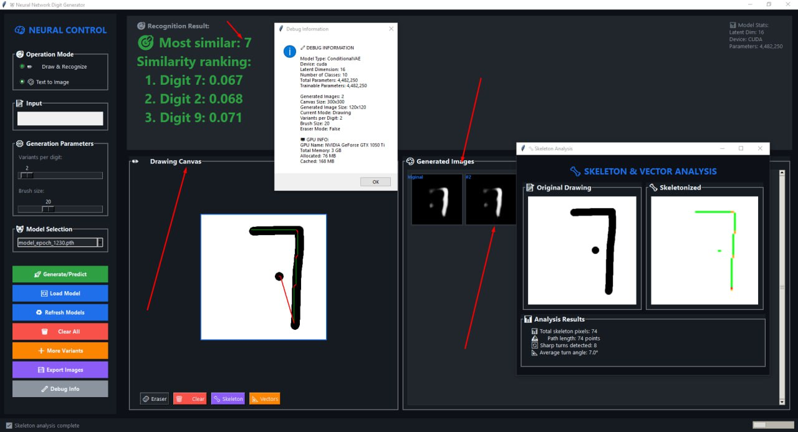

# Neural Control - Interactive Drawing Recognition System

## Описание
**Neural Control** — это интерактивная система для рисования и распознавания цифр с использованием нейросетевых моделей. Программа позволяет пользователю рисовать цифры в реальном времени, анализировать их и сравнивать с эталонными изображениями из базы данных модели.

---

## Основные функции

### Режимы работы:
- **Draw & Recognize** — рисование и мгновенное распознавание цифры.
- **Text to Image** — генерация изображения по текстовому описанию.

### Входные параметры:
- **Variants per digit** — количество вариантов генерации для каждой цифры (от 1 до 9).

### Выбор модели:
- Доступна модель **Double** (использует пулы, 1230 точек).

---

## Управление генерацией / профилем:
- **Load Model** — загрузка предобученной модели.
- **Refresh Module** — обновление модуля распознавания.
- **Clear All** — очистка холста и данных.
- **Export Images** — экспорт сгенерированных изображений.
- **Debug Info** — отладочная информация.

---

## Анализ сходства:
Система ранжирует распознанную цифру по степени сходства с эталонными изображениями.  
Пример вывода:

Digit 7: 0.067

Digit 2: 0.068

Digit 9: 0.071

---

## Холст для рисования:
Интерактивная область для ввода цифр.  
Ссылки для дополнительной информации:
1. [Drawing Examples](https://www.drawing.com/)
2. [Tutorials](https://www.drawing.com/)
3. [Advanced Features](https://www.drawing.com/)

---

## Визуализация и анализ:
### Раздел "Skeleton & Vector Analysis":
- Отображает исходное изображение и результаты анализа.
- **Total skeleton patch**: количество сегментов скелетона.
- **Path length**: длина пути в точках.
- **Annotations**: уровень аннотаций (например, 0.25).
- **Average turn angle**: средний угол поворота (например, 7.0°).

---

## Статус выполнения:
- После завершения анализа отображается уведомление:  
  **"Selected analysis complete"**.

---

## Использование
1. Выберите модель и параметры генерации.
2. Нарисуйте цифру на холсте.
3. Система автоматически выполнит распознавание и анализ.
4. Просмотрите результаты в разделах «Similarity ranking» и «Skeleton & Vector Analysis».

---

## Системные требования
- Поддержка современных браузеров с HTML5 Canvas.
- Доступ к загруженным моделям распознавания.

---

## Примечания
- Для работы в режиме **Text to Image** требуется предварительная настройка генеративной модели.
- Режим **Debug Info** полезен для разработчиков и тестирования.

